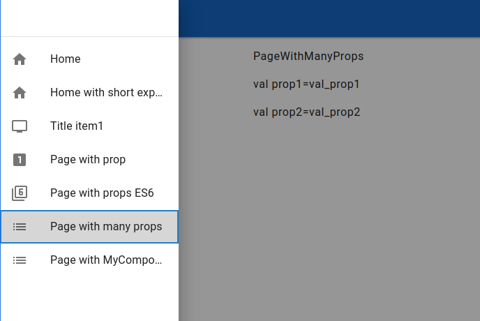

# Простой проект на React (+ React Material Design)

[React Material Design](https://react-md.dev)

### Тестирование (Jest)

Добавить jest

````shell
yarn add --dev react-test-renderer
````

Тесты размещены в `src/__tests__/`

Проведение теста

````shell
yarn test
````

Результат тестирования:

````
 PASS  src/__tests__/constants.spec.js
  constatnts
    ✓ Форматирование даты formatDate (6 ms)
    ✓ Форматирование чисел (2 ms)

Test Suites: 1 passed, 1 total
Tests:       2 passed, 2 total
Snapshots:   0 total
Time:        2.358 s, estimated 3 s
Ran all test suites.

Watch Usage: Press w to show more.

Done in 6.50s
````

### Компиляция для prod

````shell
yarn build-prod
````

Компиляция идет долго (Done in 71.50s).

Log:

````
Compiled successfully.

File sizes after gzip:

  82.15 kB  build/static/js/main.80e63489.js
  17.81 kB  build/static/css/main.f8c9eeb6.css
  1.79 kB   build/static/js/787.62ea5e01.chunk.js

The project was built assuming it is hosted at /.
You can control this with the homepage field in your package.json.

The build folder is ready to be deployed.
You may serve it with a static server:

  serve -s build

Find out more about deployment here:

  https://cra.link/deployment

Done in 71.50s.
````

### Локальный запуск

````shell
react-md-my/simple$ yarn start
````

(описание шага 'start' в package.json ->scripts->start)

````json
  "scripts": {
    "start": "react-scripts start",
````

Экран:



### Размещение на сайте

Содержимое каталога react-md-my/simple/build скопировать в /var/www/react-md-simple

### VS Code

> **_NOTE:_**
>
>Switch between code window/terminal:<br/>
>Press __Ctrl + `__ (backtick) to focus the terminal.<br/>
>Press __Ctrl + 1__ to focus the editor.

***

### ReactMD and Create React App Example

This project was bootstrapped with [Create React App](https://github.com/facebook/create-react-app) using [react-md](https://react-md.dev) as the component library.

### What's Included

This example will setup an example Create React App + ReactMD app that has the following features:

- [\_everything.scss](./src/_everything.scss) to override the default `react-md` theme and feature toggles
- a reusable [Layout.js](./src/components/Layout/Layout.js) that:
  - updates all the icons to use `SVGIcon`s instead of `FontIcon`s
  - initializes the `Layout` component from `react-md` with navigation items
  - uses [react-router-dom](https://www.npmjs.com/package/react-router-dom) as the routing library

### How to Use

Since this example is not a separate repo, this example will need to be manually downloaded instead of using `create-react-app`:

```bash
curl https://codeload.github.com/mlaursen/react-md/tar.gz/main | tar -xz --strip=2 react-md-main/examples/create-react-app
cd create-react-app
```

Install it and run:

```sh
npm install
npm start
# or
yarn
yarn start
```

### Learn More

To learn more about react-md and Create React App, take a look at the following resources:

- [react-md Documentation](https://react-md.dev)
- [Configuring your Layout](https://react-md.dev/guides/configuring-your-layout)
- [Create React App Documentation](https://create-react-app.dev/)

***

# Getting Started with Create React App

This project was bootstrapped with [Create React App](https://github.com/facebook/create-react-app).

## Available Scripts

In the project directory, you can run:

### `npm start`

Runs the app in the development mode.\
Open [http://localhost:3000](http://localhost:3000) to view it in your browser.

The page will reload when you make changes.\
You may also see any lint errors in the console.

### `npm test`

Launches the test runner in the interactive watch mode.\
See the section about [running tests](https://facebook.github.io/create-react-app/docs/running-tests) for more information.

### `npm run build`

Builds the app for production to the `build` folder.\
It correctly bundles React in production mode and optimizes the build for the best performance.

The build is minified and the filenames include the hashes.\
Your app is ready to be deployed!

See the section about [deployment](https://facebook.github.io/create-react-app/docs/deployment) for more information.

## Learn More

You can learn more in the [Create React App documentation](https://facebook.github.io/create-react-app/docs/getting-started).

To learn React, check out the [React documentation](https://reactjs.org/).

### Code Splitting

This section has moved here: [https://facebook.github.io/create-react-app/docs/code-splitting](https://facebook.github.io/create-react-app/docs/code-splitting)

### Analyzing the Bundle Size

This section has moved here: [https://facebook.github.io/create-react-app/docs/analyzing-the-bundle-size](https://facebook.github.io/create-react-app/docs/analyzing-the-bundle-size)

### Making a Progressive Web App

This section has moved here: [https://facebook.github.io/create-react-app/docs/making-a-progressive-web-app](https://facebook.github.io/create-react-app/docs/making-a-progressive-web-app)

### Advanced Configuration

This section has moved here: [https://facebook.github.io/create-react-app/docs/advanced-configuration](https://facebook.github.io/create-react-app/docs/advanced-configuration)

### Deployment

This section has moved here: [https://facebook.github.io/create-react-app/docs/deployment](https://facebook.github.io/create-react-app/docs/deployment)

### `npm run build` fails to minify

This section has moved here: [https://facebook.github.io/create-react-app/docs/troubleshooting#npm-run-build-fails-to-minify](https://facebook.github.io/create-react-app/docs/troubleshooting#npm-run-build-fails-to-minify)

### Other links

[React MD color-palette](https://react-md.dev/colors-and-theming/color-palette)
